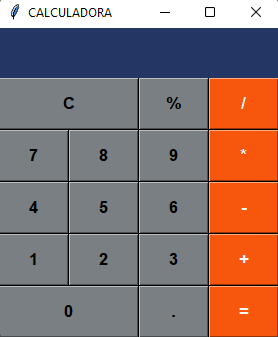

# Calculadora
Calculadora básica desenvolvida em Python.

## 1. Etapas
O projeto da calculadora foi separado em algumas etapas para poder ser devidamente otimizado e direcionado segundo os esforços necessários a cada fase.

1º etapa: criar e importar as bibliotecas que serão utilizadas inicialmente.

2º etapa: criar a janela da calculadora e fazer as primeiras configurações básicas. 

3º etapa: dividir a janela em dois quadros(sendo o visor das nossa calculadora e o corpo) e realizar algumas configurações.

4ª etapa: começar a criar os botões e as suas configurações.

5º etapa: verificar e refazer as configurações essenciais, como definir a cor dos botões.

6º etapa: após todas as configurações, criar a lógica para os cálculos.

7ª etapa: resultado final no tkinter.

## 2. Pacote tkinter

Tkinter é uma biblioteca da linguagem Python que acompanha a instalação padrão e permite desenvolver interfaces gráficas. Isso significa que qualquer computador que tenha o interpretador Python instalado é capaz de criar interfaces gráficas usando o Tkinter, com exceção de algumas distribuições Linux, exigindo que seja feita o download do módulo separadamente.

## 3. Cores

As cores utilizadas para a nossa calculadora podem ser encontradas diretamente no google com a ferramenta color picker. Basta selecionar a cor e copiar o seu código - circulado de vermelho - clicando onde está a setinha do lado direito. Depois de copiado, crie uma variável no seu programa e atribua o código da cor a sua variável.

## 4. Criando frames 
Um frame é uma janela com propriedades adicionais que a habilitam a ter uma "vida independente" no sistema de janelas gráficas. Para que um frame seja apresentado pela aplicação, um objeto desse tipo de classe deve ser criado e algumas de suas propriedades básicas -- tais como sua dimensão e o fato de estar visível -- devem ser estabelecidas.

Para a calculadora foram criadas duas frames, uma para exibir a tela com as operações e resultados, e outra para exibir os botões com os números e operadores.

## 5. Criando botões

Para cada botão foi nescessário uma variável o identificando. Definimos então:

- A qual frame ele pertenceria;
- A ação que seria executada ao clica-lo;
- Seu texto;
- Largura(width) e altura(height);
- Cor de fundo(bg);
- Tipo e estilo da fonte;
- Relevo e seu estilo(relief);

