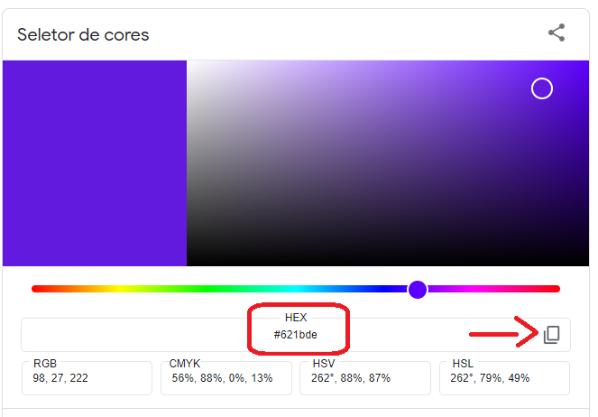

# Calculadora
Calculadora básica desenvolvida em Python.

## 1. Etapas
O projeto da calculadora foi separado em algumas etapas para poder ser devidamente otimizado e direcionado segundo os esforços necessários a cada fase.

1º etapa: criar e importar as bibliotecas que serão utilizadas inicialmente.

2º etapa: criar a janela da calculadora e fazer as primeiras configurações básicas. 

3º etapa: dividir a janela em dois quadros(sendo o visor das nossa calculadora e o corpo) e realizar algumas configurações.

4ª etapa: começar a criar os botões e as suas configurações.

## 2. Biblioteca tkinter

Tkinter é uma biblioteca da linguagem Python que acompanha a instalação padrão e permite desenvolver interfaces gráficas. Isso significa que qualquer computador que tenha o interpretador Python instalado é capaz de criar interfaces gráficas usando o Tkinter, com exceção de algumas distribuições Linux, exigindo que seja feita o download do módulo separadamente.

## 3. Cores

As cores utilizadas para a nossa calculadora podem ser encontradas diretamente no google com a ferramenta color picker. Basta selecionar a cor e copiar o seu código - circulado de vermelho - clicando onde está a setinha do lado direito. Depois de copiado, crie uma variável no seu programa e atribua o código da cor a sua variável.

